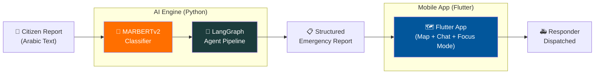
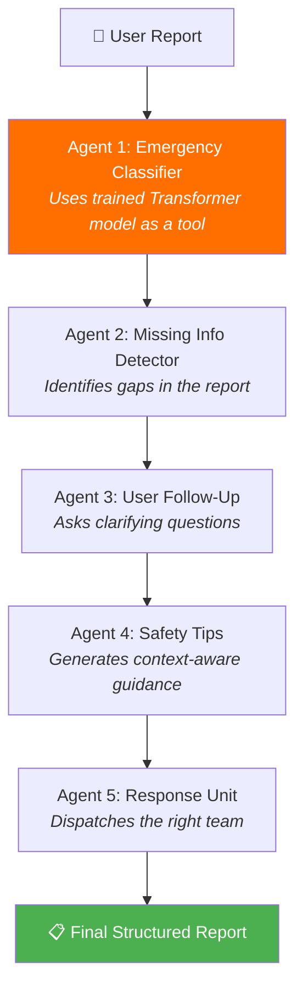

<div align="center">

# 🚨 Smart Emergency Platform

**An end-to-end AI-powered emergency response system for Syria**

[](https://flutter.dev)
[](https://tensorflow.org)
[](https://langchain-ai.github.io/langgraph/)
[](https://python.org)
[](https://dart.dev)

_Classifies Arabic emergency reports using a custom Transformer model, orchestrates intelligent triage through a multi-agent pipeline, and delivers real-time coordination to responders on the ground._

[🎬 Watch Demo](#-demo) · [🧠 AI Engine](#-ai-engine) · [📱 Mobile App](#-mobile-app) · [🚀 Get Started](#-getting-started)

</div>

---

## 🎬 Demo

<div align="center">

[](https://www.youtube.com/watch?v=6K-MnKjv4jA)

_Click the image above to watch the full platform walkthrough_

</div>

### 📸 Screenshots

<div align="center">
<table>
  <tr>
    <td><br/><em>AI Agent Report</em></td>
    <td><br/><em>Safety Tips Chat</em></td>
    <td><br/><em>Responder Joins</em></td>
    <td><br/><em>Inspect Report on Map</em></td>
  </tr>
  <tr>
    <td><br/><em>Assign Responders</em></td>
    <td><br/><em>Blue Force Tracking</em></td>
    <td><br/><em>Assignment Alert</em></td>
    <td><br/><em>Focus Mode + Route</em></td>
  </tr>
</table>
</div>

---

## 🧩 The Problem

In post-conflict Syria, emergency infrastructure is fragmented. Citizens report incidents in colloquial Arabic via unstructured text. Dispatchers are overwhelmed. Response times suffer. There is no unified system to **classify**, **triage**, and **coordinate** emergency responses in Arabic.

**This platform solves that** by combining a custom-trained Transformer model with an intelligent agent pipeline and a real-time mobile coordination app.

---

## 🏗️ System Architecture



| Layer          | Tech                   | Purpose                                                     |
| -------------- | ---------------------- | ----------------------------------------------------------- |
| **AI Engine**  | TensorFlow + LangGraph | Classify, triage, and enrich emergency reports              |
| **Mobile App** | Flutter + Dart         | Real-time map, navigation, chat, and responder coordination |

---

## 🧠 AI Engine

### Custom Transformer Classifier

A **Hierarchical Expert Architecture** built on **MARBERTv2** (state-of-the-art Arabic BERT) that performs three tasks simultaneously:

| Task           | Method                   | Output                                  |
| -------------- | ------------------------ | --------------------------------------- |
| **Main Class** | Softmax Head             | e.g., `FIRE`, `CRIME`, `MEDICAL`        |
| **Subclass**   | Conditional Expert Heads | e.g., `structure_fire`, `armed_robbery` |
| **Severity**   | Context-Aware Regression | 1–10 scale adapted per category         |

**Key Innovation:** Each main class has its own specialized subclass head. The model _routes_ predictions through the correct expert — the "Fire Expert" never sees crime data during training (via **gradient masking**).

**Training Data:** 38 custom Arabic emergency datasets covering categories from `structure_fire` to `kidnapping`.

> 📓 See the full training notebook: [`ai/notebooks/transformer_training.ipynb`](ai/notebooks/transformer_training.ipynb)

### Multi-Agent Triage Pipeline

A **LangGraph StateGraph** orchestrates 5 specialized agents that process each report:



| Agent                     | Role                      | How                                    |
| ------------------------- | ------------------------- | -------------------------------------- |
| `emergency_type_agent`    | Classifies the incident   | Calls the trained TF model via `@tool` |
| `get_missing_info_agent`  | Finds info gaps           | LLM + category-specific question banks |
| `ask_for_missing_info`    | Collects user input       | Interactive follow-up                  |
| `get_safety_tips_agent`   | Generates safety guidance | LLM + curated Arabic tips database     |
| `get_response_unit_agent` | Dispatches responders     | Rule-based mapping + location          |

> 📁 Agent source code: [`ai/agents/`](ai/agents/)

---

## 📱 Mobile App

A **Flutter** application serving as the real-time Command & Control interface.

### Key Features

#### 🗺️ Live Map Dashboard

- Real-time emergency markers with **color-coded** severity indicators
- **5-second polling** for incident data freshness
- Custom icons for each emergency type (🔥 Fire, 🚔 Police, 🏥 Medical)

#### 🎯 Focus Mode (Responder Tactical View)

- **Turn-by-turn routing** to the incident with ETA overlay
- Route fallback to **straight-line navigation** when APIs fail
- **Blue Force Tracking** — see other responders' live positions on the map
- Integrated **drag-up chat** for hands-free communication

#### 💬 Emergency Chat

- **Geo-tagged messaging** — every message carries location context
- Duplicate conversation prevention
- **AI Emergency Chat** screen for triage assistance

#### 🛡️ Resilient Architecture

- **Optimistic UI** — instant feedback while syncing with flaky networks
- **Defensive JSON parsing** — handles backend schema drift gracefully
- **Multi-fallback location extraction** — hunts for valid coordinates across 4+ data sources

> 📁 Feature modules: [`lib/features/`](lib/features/)

---

## 🛠️ Tech Stack

| Category         | Technologies                                                          |
| ---------------- | --------------------------------------------------------------------- |
| **AI / ML**      | TensorFlow, HuggingFace Transformers, MARBERTv2, LangGraph, LangChain |
| **Mobile**       | Flutter, Dart, flutter_bloc (Cubit), flutter_map, geolocator          |
| **Backend Comm** | Dio (REST), Socket.IO (real-time), Polling agents                     |
| **Architecture** | Clean Architecture, Feature-Sliced Design, LangGraph StateGraph       |
| **Data**         | 38 Arabic emergency CSVs, Pickle encoders, TF SavedModel              |

---

## 📂 Project Structure

```
├── ai/                          # 🧠 AI Engine
│   ├── agents/                  # LangGraph multi-agent pipeline
│   │   ├── emergency_coordinator.py
│   │   ├── emergency_type_agent.py
│   │   ├── get_missing_info_agent.py
│   │   ├── get_safety_tips_agent.py
│   │   └── get_response_unit_agent.py
│   ├── notebooks/
│   │   └── transformer_training.ipynb
│   ├── data/
│   │   └── sample_emergency_data.csv
│   ├── main.py
│   ├── llm.py
│   └── requirements.txt
│
├── lib/                         # 📱 Flutter Mobile App
│   ├── features/
│   │   ├── assignments/         # Focus Mode & responder tasks
│   │   ├── chat/                # Emergency messaging + AI chat
│   │   ├── dashboard/           # Unified map + reports view
│   │   ├── reports/             # Incident data models & state
│   │   ├── users_location/      # Blue Force Tracking
│   │   ├── auth/                # Authentication
│   │   └── profile/             # User management
│   ├── services/                # Routing, geocoding, navigation
│   └── main.dart
│
├── docs/                        # 📚 Documentation & media
│   └── screenshots/
└── pubspec.yaml
```

---

## 🚀 Getting Started

### AI Engine

```bash
cd ai/
pip install -r requirements.txt
export OPENAI_API_KEY="your-key-here"
python main.py
```

> ⚠️ The trained TensorFlow model weights (`Models/`) are not included due to size. Contact the maintainer or retrain using `notebooks/transformer_training.ipynb`.

### Flutter App

```bash
flutter pub get
flutter run
```

---

## 👤 Author

**Zen Makhlouf**

Built as a capstone project demonstrating the full integration of custom AI models into production mobile applications.

---

<div align="center">

_If this project interests you, ⭐ the repo — it helps a lot!_

</div>
